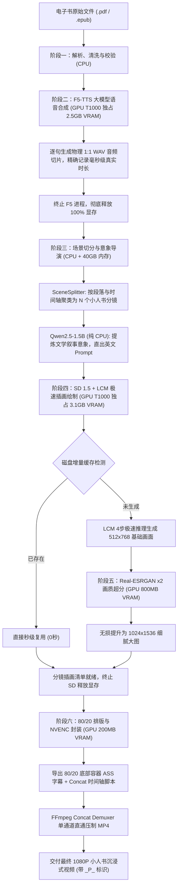
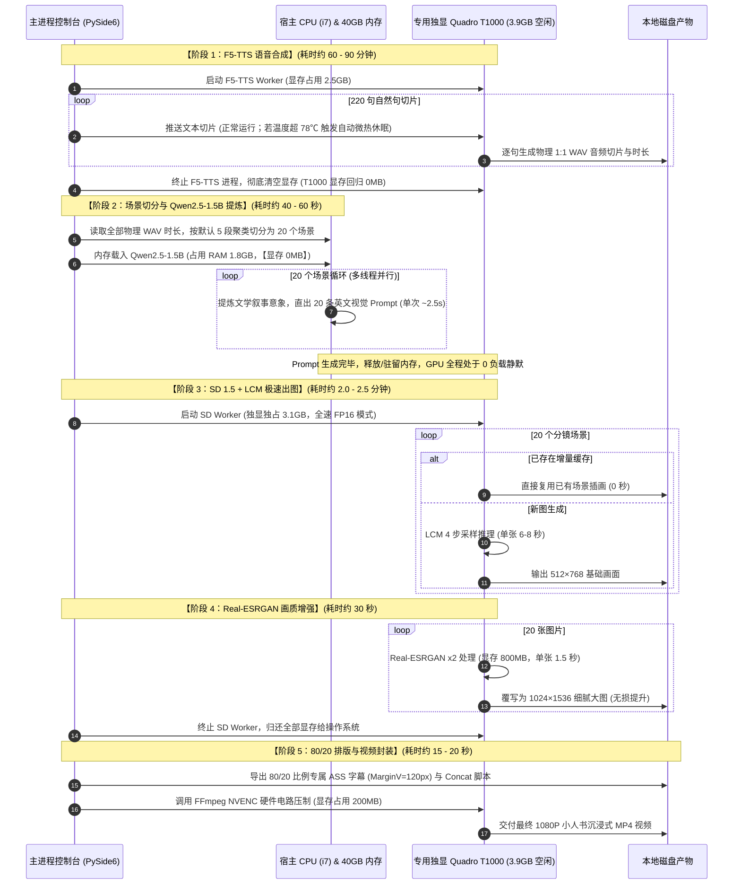

# 书声（ShuSheng）v2.0 产品需求文档 PRD

---

## 1. 产品概述

### 1.1 产品名称与定位
- **产品中文名**：书声
- **内部英文名**：ShuSheng
- **产品定位**：一款面向创作者与读者的桌面自动化有声书与视频生产工具。能够将 PDF、EPUB 等电子书，通过高度自动化的确定性流程，转换为包含清晰旁白、精准原文字幕、自适应背景音乐、定制封面、主标题与自动副标题的高清分集 MP4 有声视频，同时完整保留底层的有声书（MP3 / M4B）生产能力。

### 1.2 产品边界与设计哲学
书声不是：
- 复杂的非线性视频剪辑软件（如剪映、Premiere）；
- 简单的单句 TTS 试听小工具；
- 依赖大语言模型临场自由发挥改写正文的不可控 Agent。

核心设计哲学：
- **忠实原文**：严禁 AI 自行删改、润色或总结正文，保证有声朗读与字幕文字 100% 忠实于书籍原版；
- **全流程自动化**：用户只需进行初始配置并确认生产计划，其余文本解析、语音合成、字幕对齐、音量混音与视频合成均由系统自动流水线处理；
- **长任务可靠性**：针对长篇巨著数小时乃至数十小时的生产需求，必须支持安全暂停、断点续跑和局部故障隔离，绝不轻易因局部问题重做整书。

---

## 2. 目标用户与核心场景

### 2.1 目标用户
1. **个人深度阅读者**：希望将私藏的电子书转换为适合通勤、运动时听的高品质有声书或视频；
2. **知识自媒体创作者**：需要批量制作分章节、带字幕、带画面的电子书有声视频发布至抖音、快手、微信视频号、B站、YouTube等平台；
3. **视障及阅读障碍辅助人群**：需要清晰朗读正文并提供高对比度字幕的辅助阅读工具。

*注：用户应确保输入内容符合其所在地适用的版权及使用授权要求。*

### 2.2 核心使用场景
用户桌面启动“书声”图形客户端：
1. 拖入或选择一本电子书（PDF 或 EPUB）；
2. 设定书名、正文起始页/章节，选择 TTS 引擎与心仪音色；
3. 选择视频版式（默认 9:16 竖屏手机端，或 16:9 横屏电脑端）；
4. 配备背景音乐与封面，通过 10~20 秒混音试听微调旁白与音乐比例；
5. 系统自动分析全书生成“生产计划预览”（展示字数、预估时长、分集规划）；
6. 用户确认后启动生产，期间可随时“安全暂停”，下次启动自动断点续跑；
7. 生产完成后直接输出成品 MP4 视频与音频文件，可一键打开输出目录。

---

## 3. 用户入口与 GUI 界面规范

### 3.1 用户入口
- **正式用户入口**：PySide6 桌面图形界面（GUI）。
- **运行方式**：双击桌面图标或执行启动脚本即可进入图形主界面，普通用户无需接触命令行，绝不感知多个 Python 虚拟环境与底层子进程调用。
- **CLI 定位**：命令行仅保留作为开发调试、单元测试及批处理诊断用途。

### 3.2 GUI 界面布局规范
主界面遵循“左侧参数配置、右侧实时预览、底部全局控制”的直观布局：

```text
┌─────────────────────────────────────────────────────────────────────────┐
│                              书声 (ShuSheng)                            │
├──────────────────────────────────┬──────────────────────────────────────┤
│ 【项目与输入设置】               │ 【封面与排版预览】                   │
│  书籍文件：[选择文件...] path.pdf│  ┌────────────────────────────────┐  │
│  书籍名称：[人类简史           ] │  │          主标题预览            │  │
│  正文起始：[第 15 页           ] │  │          [封面图像]            │  │
│                                  │  │         第01集·副标题          │  │
│ 【声音与引擎】                   │  │         【精准原文字幕】       │  │
│  TTS 引擎：[ F5-TTS          ▼ ] │  └────────────────────────────────┘  │
│  音色选择：[ 男声/商业精英D1  ▼ ] │ 【生产计划与状态】                   │
│  音质模式：[ 快速 / 标准 / 高清] │  章节总数：24 章 | 总字数：32.8 万   │
│                                  │  预估总长：18.5 小时 | 预计分集：37集│
│ 【音视频版式】                   │  硬件状态：NVIDIA T1000 (状态良好)   │
│  视频版式：[ 竖屏 9:16 (手机) ▼] │                                      │
│  单集时长：[ 30 分钟         ▼ ] │ 【混音试听】                         │
│  运行方式：[ 生成下一集      ▼ ] │  [▶ 播放15秒试听片段]                │
│  背景音乐：[选择音频...] bgm.mp3 │                                      │
│  封面图片：[选择图片...] cov.jpg │                                      │
│  视频标题：[人类简史精选有声书 ] │                                      │
├──────────────────────────────────┴──────────────────────────────────────┤
│  旁白音量：[────────────●───────] 100%                                  │
│  音乐音量：[────●───────────────]  15%  (开启人声说话自动压低音乐)      │
├─────────────────────────────────────────────────────────────────────────┤
│  [ 生成生产计划 ]   [ 开始生产 ]   [ 安全暂停 ]   [ 继续生产 ]  [ 打开目录 ] │
│  当前进度：正在生成第 01 集 (语音生成中...)                              │
│  [████████████████████░░░░░░░░░░░░░░░░░░░░] 42% (剩余时间约 18 分钟)     │
└─────────────────────────────────────────────────────────────────────────┘
```

---

## 4. 核心功能需求

### 4.1 书籍导入与正文定位
1. **支持格式**：PDF、EPUB。
2. **文本型检查**：自动检测 PDF 是否具备可提取的文字层。若为纯扫描图片且无文本层，给出友好提示（`SCAN_PDF_NOT_SUPPORTED`），避免输出乱码。
3. **智能元数据识别**：导入文件后，自动解析文件元数据与首部信息，预填“书籍名称”，允许用户自行修改。
4. **正文起始位置设定**：
   - **PDF 文件**：提供“正文起始页”输入（以 PDF 物理页面序号为准），自动跳过封面、折页、前言、目录及出版版权信息；
   - **EPUB 文件**：提供“正文起始章节”下拉选择，跳过非正文内容；
   - *注意*：起始位置仅在首次初始化正文范围时生效，断点续跑时不要求用户重复输入。

### 4.2 TTS 引擎与音色完全解耦
系统将“TTS 引擎”与“音色配置”彻底分离为两个独立选择项：
1. **TTS 引擎选择**：
   - **F5-TTS**：本地高质量声音方案，支持情感自然表达与音色复刻；
   - **Kokoro**：本地超轻量快速方案，无显存压力；
   - **Azure AI Speech**：云端官方高质量稳定服务（需配置凭证）。
2. **音色独立选择**：
   - 不再向用户展示晦涩的模型路径或引擎内部参数；
   - 提供直观命名，如“男声 / 商业精英 (D1)”、“男声 / 新闻播报 (D2)”、“女声 / 知性解说”、“男声 / 厚重学者”等；
   - 切换音色不影响引擎底层的调度配置。
3. **引擎资源与硬件状态透明感知**：
   - 切换引擎时，自动检测当前硬件（GPU 显存、CUDA 支持）是否就绪；
   - 若本地模型尚未就绪，界面明确显示“准备下载模型”状态并提供一键自动初始化体验，显示下载进度条与校验状态，避免用户手动配置。
4. **运行参数与切分质量规范**：
   - GUI 提供推理步数预设选择（“快速(8步) / 标准(16步) / 高质量(32步)”），默认固化 16 步兼顾质量与散热；
   - **自然文本切分规范**：正式生产严禁使用 26 字暴力硬切（此前实验已证实硬切会严重破坏语义连贯性并放大句首丢词），系统必须严格基于自然标点断句；
   - **Voice Profile 准入机制**：F5 音色参考音频与参考文本必须 100% 逐字精确对应，且音频必须在自然完整语义和静音低谷处闭合（严禁以“与此同时、但是、如果”等未完结连接词截断）；新音色投入生产前必须通过最小语音回归测试（0 漏词、0 多字）。

### 4.3 视频版式与自动排版引擎 (Video Layout Engine)
系统杜绝“封面什么比例、视频就粗暴拉伸成什么比例”的丑陋效果，内建 **Video Layout Engine**：
1. **版式选项**：
   - **竖屏 9:16（1080 × 1920）**：系统默认推荐，完美适配抖音、快手、微信视频号、Shorts 等移动端短视频与全屏播放器；
   - **横屏 16:9（1920 × 1080）**：适配 B站、YouTube、西瓜视频、PC端与电视大屏。
2. **自动版面布局原则**：
   - **严禁拉伸变形**：封面图片无论原始长宽比，始终采用“等比缩放并在安全区完整呈现（Contain）”原则；
   - **背景智能补充**：画面留白区域自动采用封面动态高斯模糊渐变或精致深色背景填充，观感和谐大气；
   - **文字与安全区**：主标题、集数副标题、字幕均位于专业安全显示区，绝不遮挡或裁切书籍封面上的原书名与核心要素。

### 4.4 混音系统、音量控制与双轨试听
1. **双轨独立音量控制**：
   - 旁白（人声音频）：0% ~ 200% 可调，默认 100%；
   - 背景音乐（BGM）：0% ~ 100% 可调，默认 15%。
2. **自动闪避（Ducking / 智能压音）**：
   - 用户体验语言：“说话时自动降低背景音乐，保证旁白清晰”；
   - 当有人声朗读时，BGM 自动下潜平滑衰减，人声停顿或间隙时 BGM 轻微自然浮起；
   - 片尾伴随人声结束，BGM 自动平滑淡出，不突兀断音。
3. **10~20 秒混音真实试听**：
   - 正式生产前，用户可点击“播放混音试听”，GUI 实时播放或合成一段包含旁白与背景音乐的真实混音片段；
   - **一致性保证**：试听所听即所得，试听所采用的增益计算与自动闪避参数与最终批量合成视频完全一致，杜绝“试听轻柔、成品炸耳”的割裂体验。

### 4.5 字幕体验（100% 忠实原文）
1. **零 ASR 识别误差**：
   - 字幕文字 100% 直接来源于电子书原文；
   - 杜绝传统视频剪辑软件二次语音识别导致的专业术语、人名、地名、同音字识别错别字现象。
2. **高精度同步**：
   - 字幕时间区间与旁白发音精准吻合，语停字止；
   - 普通用户无需感知字幕是如何计算生成的，在最终 MP4 画面中即呈现为专业排版的中文字幕。

### 4.6 智能分集规划与生产计划预览
1. **自然章节边界分集**：
   - 用户可设定“单集目标时长”（如 15分钟、30分钟、45分钟、60分钟，默认 30 分钟）；
   - 系统绝不在 30:00 机械切断一句话或切碎章节；分集规划算法保证以“完整章节”为合并基准，寻找最接近目标时长的章节边界；若单个章节极长超过目标时长，则独立作为完整一集。
2. **生产计划全景预览**：
   - 在正式执行前，点击“生成生产计划”，弹出清晰摘要面板；
   - 明确告知用户：预计生产集数、每集包含章节、预估耗时、选定音色与版式；
   - 用户点击“确认并开始”后才正式投入计算。

### 4.7 三种运行方式与夜间无人值守友好
为了满足用户不同硬件负载与时间要求，提供三种运行方式：
1. **全书模式**：连续处理直至整本书所有集数全部完工，适合性能充沛或长时间挂机；
2. **仅生成下一集**：本次只处理并完整输出紧接着的一集视频，生成完毕立即安全停机并释放 GPU；
3. **本次运行上限**：用户指定单次最长运行时间（如“本次运行 60 分钟”），系统在达到上限后，**寻找最近的完整分集边界**安全结束并休眠，避免笔记本半夜无人值守高温过热。

### 4.8 任务安全暂停与断点续跑 (Safe Pause & Resume)
1. **安全暂停（Safe Pause）**：
   - 用户随时可点击“安全暂停”；
   - 系统不直接暴力杀死模型进程，而是“完成当前正朗读的微小单元后立即存盘”，保存当前进度状态与检查点，安全关闭模型释放显存，任务进入“已暂停”状态；
2. **断点续跑（Resume）**：
   - 重启程序后，自动检测未完成任务，弹窗提示“发现未完工任务：《某某书》，当前进度 42%，已完成 1~3 集，准备继续第 4 集”；
   - 用户点击“继续任务”，无需重新选择起始页或重新配置，系统从断点处无缝接续，**已成功生成的音频和视频片段 100% 缓存复用，绝不重复生成**。

### 4.9 小人书沉浸式图文同步播放模式 (Storybook Mode) [v3.3.0 新增]

#### 4.9.1 功能背景与体验目标
传统单封面有声视频在长达数十分钟的播放中，画面处于静止状态，观众容易产生视觉疲劳。
“小人书”沉浸式图文模式旨在重现经典连环画（小人书）的阅读体验：
- **上图下文版面**：屏幕上方 80% 区域呈现根据当前故事情节生成的专属高清插画，下方 20% 呈现高对比度逐句跟读字幕；
- **音画随动翻页**：根据段落进度与真实音频物理时长自动切换插画，听众如同在翻阅一本有声图文画卷；
- **双显卡协同优化**：核显（Intel UHD）负责屏幕交互与桌面渲染，独显（NVIDIA T1000）作为专用离屏算力引擎，生产时推荐不插 HDMI 外接屏以达到极致纯净算力与低温运行。

#### 4.9.2 按真实物理时间线重构的全流程管线与 12 节点严谨物理定义

##### 1. 真实物理时间线全流程管线图


##### 2. 12 个节点的严谨物理定义与执行说明

| 阶段分类 | 节点序号与名称 | 内部状态码 | 详细业务逻辑与物理意义 |
| :--- | :--- | :--- | :--- |
| **一、解析规划** | **1. 结构解析** | `PARSED` | 读取 PDF/EPUB 源文件，精准抽取目录树、章节名与自然段落。 |
|  | **2. 正文清洗** | `CLEANED` | 过滤页眉页脚与非文本噪点，执行年份口语化、多音字规整与中英文分词清洗。 |
|  | **3. 规划就绪** | `PLANNED` | 依据章节或时长算法完成分集规划与 SpeechUnit 切块，生成全景生产计划。 |
| **二、声音时序** | **4. 语音合成** | `TTS_GENERATING` | 调度 F5-TTS 大模型，对分集文本逐句合成 WAV，并获取**每个语音单元的毫秒级精确起始与截止时间戳**。 |
|  | **5. 字幕对齐** | `ALIGNING_SUBTITLES` | 依据真实生成的语音时长，完成毫秒级音字对齐，生成基准 SRT / ASS 字幕流。 |
| **三、视觉生成**<br>*(小人书专属)* | **6. 意象提炼** | `SCENE_PROMPTING` | 根据真实音频时序将自然段聚类为场景分镜，调度 **Qwen 意象导演模型**，深度提炼场景核心画面意象与英文 SD 提示词。 |
|  | **7. 大模型绘图** | `ILLUSTRATING` | 调度 **SD 1.5 + LCM-LoRA 模型**进行 GPU 绘图推理（显存不足时自动触发 40GB 内存 CPU Offload 算力兜底）；**若本地缺少模型则立即报错阻断，杜绝产出文字框废片**。 |
|  | **8. 分辨率增强** | `UPSCALING` | 对生成的 512x768 基础场景原画执行 **Real-ESRGAN x2 智能超分**，输出 1024x1536 细腻大图。 |
| **四、后期压制** | **9. 智能混音** | `AUDIO_MIXING` | 在画面与人声均就绪后，将人声主音轨与背景音乐 BGM 进行**智能侧链避让混音 (Sidechain Ducking)**，合成最终高保真混音音轨。 |
|  | **10. 视频合成压制** | `VIDEO_RENDERING` | 将插画画面序列、混音音频轨与底部 ASS 字幕容器，通过 NVENC 硬件加速压制为最终 MP4 视频（带插画视频命名注入 `_P_` 标识）。 |
| **五、质检交付** | **11. 成品质检校验** | `QUALITY_CHECK` | **成片后的严谨质检**：核验最终 MP4 视频时长与音频是否绝对一致、检查是否有黑帧或静音损坏、校验字幕末尾时间轴。 |
|  | **12. 生产完成** | `COMPLETED` | 质检合格，将成片与 Manifest 元数据正式归档并交付至目标输出目录。 |

> **注（双轨兼容）**：若未开启小人书模式（标准封面视频），管线自动跳过节点 6、7、8，在完成节点 5 字幕对齐后直接进入节点 9 智能混音与节点 10 标准封面压制，逻辑 100% 严密且双轨绝对隔离。

##### 3. 业务阶段与数据流向概览


##### 2. 硬件资源分时复用与时序泳道协同管线图


#### 4.9.3 真实生产环境管线用时与硬件资源图
> 基准：ThinkPad P1 Gen 3（i7-10750H, 40GB RAM, Quadro T1000 4GB），生产一集 **15 分钟标准成片（约 20 个小人书分镜）**：

```text
时间轴与硬件资源分配（总耗时约 64 ~ 95 分钟，小人书增量仅占约 5%）：
┌───────────────────────────────────────────────────────────┬──────┬─────────┬────────┬────────┐
│ 阶段与任务                                                │ 算力 │ 内存RAM │ 显存VR │ 耗时   │
├───────────────────────────────────────────────────────────┼──────┼─────────┼────────┼────────┤
│ 1. 结构解析、文本清洗与两阶段分集规划                     │ CPU  │  300 MB │   0 MB │   <2 秒│
│ 2. F5-TTS 大模型语音合成 (220句切片 + 散热休眠保护)      │ GPU  │  2.5 GB │ 2.5 GB │60~90分 │
│ 3. 场景分镜切分与 WAV 物理时长对齐                        │ CPU  │  100 MB │   0 MB │ <0.1秒 │
│ 4. Qwen2.5-1.5B 视觉镜头提炼 (20镜并发/多线程)            │ CPU  │  1.8 GB │   0 MB │40~60秒 │
│ 5. SD 1.5 + LCM-LoRA 极速插画绘制 (20张 512x768)          │ GPU  │  2.0 GB │ 3.1 GB │2~2.5分 │
│ 6. Real-ESRGAN x2 级超分辨率提升 (20张提升至 1024x1536)   │ GPU  │  500 MB │ 800 MB │  ~30 秒│
│ 7. 80/20 图文排版与 FFmpeg NVENC 硬件电路压制             │ GPU  │  400 MB │ 200 MB │15~20秒 │
└───────────────────────────────────────────────────────────┴──────┴─────────┴────────┴────────┘
```

#### 4.9.4 首选与备选技术方案全景矩阵

| 管线环节 | 核心职责 | 🥇 首选方案 (默认激活) | 🥈 备选方案 (一键回退) | 方案性质与切换逻辑说明 |
| :--- | :--- | :--- | :--- | :--- |
| **场景切分** | 确定多长时间换一张图 | **默认 5 段/镜** | **支持 2 ~ 20 段灵活配置** | **参数配置项**：默认 5 自然段切一镜；叙事紧凑选 3~4 段，说理社科选 6~8 段。 |
| **意象提炼 (LLM)** | 将长段落提炼为核心视觉镜头 | **Qwen2.5-1.5B (CPU)** | **备选 A：Qwen2.5-0.5B**<br>**备选 B：rjieba 词典映射** | 首选 1.5B 意境细腻；CPU 负载高时切 0.5B；不想下载模型切 rjieba 离线保底。 |
| **插画文生图 (SD)** | 将镜头 Prompt 渲染为高雅插画 | **SD 1.5 + LCM-LoRA** | **SD 1.5 标准版 (20步)** | 首选 LCM 节省 75% 绘画时间；若需更厚重慢工笔触可一键切换为标准 20 步。 |
| **超分辨率 (SR)** | 消除放大马赛克与边缘涂抹 | **Real-ESRGAN x2 级** | **双三次抗锯齿插值** | 默认启用 Real-ESRGAN（单张仅 1.5s）；显存受阻可一键降级为纯双线性平滑。 |
| **图文排版比例** | 确定画面与文字的空间结构 | **80% 画面 + 20% 字幕** | **70% 画面 + 30% 字幕** | 首选 80/20，画面高度 1536px 连环画感极强；文字区高 384px 容纳双行绰绰有余。 |

#### 4.9.5 v3.3.4 架构解耦与界面视窗重构规范

1. **SpeechUnit 与 SceneUnit 严格分离**：
   - `SpeechUnit`：专职服务于 TTS 语音合成与 ASS 字幕；
   - `SceneUnit`：专职服务于插画分镜与视觉构图；两者通过时间戳外键松耦合，彻底杜绝 1 个 SpeechUnit = 1 张图的过度切图漏洞。
2. **每 X 句只决定图片分组，真实 TTS 时间轴锁定**：
   - 步长 X（默认 5 段/句）仅作为视觉分块边界；
   - 每个 SceneUnit 的起止时间严格由该场景第一句的 `start_time` 与最后一句的 `end_time` 计算，绝不搞机械平均分配。
3. **80/20 上图下文布局**：
   - 上半部分 80% 画框渲染纯净完整插画；
   - 下半部分 20% 容器专供居中大字字幕，字幕绝对不压在插画上。
4. **运行时单图故障优雅兜底（原则 9）**：
   - 初始化阶段本地缺失模型坚决严格阻断；
   - 批量生产中若偶发单张图片推理失败，自动继承延用上一幕有效插画继续生产，并在日志中记录告警，确保整条生产线平稳交付不中断。

#### 4.9.6 v3.3.5 纯净单框合并与五列式视窗重构规范

1. **左侧【书籍与基础版式】单框合并**：
   - 彻底废除独立的 `grp_storybook` 卡片，将小人书模式作为第 7 行直接并入【书籍与基础版式】主卡片中（完全复原第一版设计，节省垂直高度）；
   - 为“浏览...”（64px）、“选择封面...”（76px）及“单层极简”（86px）设置固定安全宽度，消除控件挤压重叠与文字截断。
2. **右上工作台五列式架构（利用中央画框左右 Letterbox 留白）**：
   - 彻底拆除视窗底沿工具条，将高度 100% 归还给视频工作台；
   - 中央画框左侧空白区：放置【绘图模型】与【图文比例】（标签 68px 靠右对齐，文字完整呈现无截断）；
   - 中央画框右侧空白区：放置【意象导演】与【画质超分】（标签 68px 靠右对齐，文字完整呈现无截断）；
   - 两翼配置列采用 `addStretch(1)` 下沉到底部，视觉上自然贴合 9:16 画框字幕区两侧。

#### 4.9.7 v3.3.6 滚动场景上下文提炼与紧凑小人书排版规范

1. **滚动上下文防动作污染机制 (Scene Rolling Context)**：
   - 提取当前 Scene 提炼绘图 Prompt 时，引入向前前 $M$ 个 Scene 的原文（$M \in [0, 4]$，默认 2）；
   - Prompt 模板明确划分【历史上下文，仅用于理解】与【当前需要生成图片的内容】；
   - 历史内容仅用于理解人物、时代、地点、指代与时空连续性；
   - 强约束规则：只能且仅为当前内容生成 15-25 个英文单词的画面意象，严禁将历史已结束或发生的动作画入当前图片；
   - 在章节开头历史不足 $M$ 个时按实际数量自适应截取，首个 Scene 自动退化为单场景提炼；
   - 调整 $M$ 纯属绘图提炼参数，不触发重新跑 TTS。
2. **小人书配置行四合一紧凑单行重构**：
   - 复选框去除冗余长文案，紧凑作为开关；
   - 步长微调框后缀统一为“句/分镜”（默认 5 句/分镜）；
   - 新增上下文数量下拉框（0/1/2/3/4 个上下文，默认 2 个上下文）；
   - 风格下拉框自适应拉伸并排，整行不占用任何额外垂直高度。

#### 4.9.8 v3.3.7 双核并发两段式管线与动态双行状态栏规范

1. **两段式并发流水线架构 (Step A & Step B)**：
   - **Step A（CPU 异步预提炼）**：在分集开始时，仅依据清洗后的自然文本和分镜规划，由 CPU 后台多核异步调度 Qwen2.5 预先提炼全部场景的 Prompt 草案（时间戳占位 0.0），与 GPU F5-TTS 语音合成并行运行；
   - **Step B（时序绑定）**：TTS 完成并确定 SRT/ASS 字幕真实时间轴后，微秒级（< 1ms）将首末 SpeechUnit 起止时间绑定至对应 SceneUnit，绝对不重新调用大模型生成 Prompt；
   - **防争抢红线**：坚决注释并禁用 F5-TTS 的 CPU 兜底逻辑，TTS 专享 GPU，Prompt 提炼专享 CPU，避免多核争抢与系统卡顿；SD 1.5 严格在 TTS 完全释放显存后再调度。
2. **状态栏双核并发双行动态排版与智能首尾截断**：
   - 并行期间状态栏字体适度缩减至 `10.5px`，以紧凑两行上下呈现；
   - **上行（GPU TTS）**：完全保持原有语音合成文案逻辑与 原文 "..." 截断规则；
   - **下行（CPU 预提炼）**：文案严格按 `CPU 正在预提炼场景意象(分镜数/总分镜数)_ 当前首句` 呈现，数值严格为分镜（Scene）数量；
   - 横向超出物理可用宽度时，自动保留前缀与首部文字 + `...` + 首句最后 10 个字，绝不横向撑爆界面；
   - 并行结束后平滑恢复单行 `13px` 标准排版。
3. **小人书控件黄金比例重平衡规范 (v3.3.9)**：
   - `spn_paras_per_scene` 固定为 `120px` 且文字居中对齐，内部 `QLineEdit` 净文本区扩展至 `69px`，彻底杜绝“5 句/分镜”被卷入视窗外只露“/镜”的截断 Bug；
   - `cmb_context_scenes` 固定为 `105px`，5 个字符紧凑舒适，不占用多余横向空间；
   - `cmb_storybook_style` 采用自适应弹性拉伸（`stretch=1`，约 `176px`），文字距右侧下拉箭头留有 35px 呼吸间距，整行右侧与上方表单输入框 100% 严丝合缝对齐，彻底消除行尾大断档。
4. **大模型首次下载动态活跃度超时与实时进度推送规范 (v3.3.10)**：
   - **动态活跃度延期**：彻底取消首次下载 4.2GB 绘图大模型时的 180s 固定死限，通过重载 `tqdm` 流式向主进程发送结构化进度 JSON，只要有网络字节下载即刻续期活跃时间戳；
   - **真实无法下载判定**：仅在连续 90 秒无任何网络数据流动、网络彻底不可达或子进程异常崩溃退出时才确认报错阻断；
   - **国内镜像加速与降噪**：自动注入 `HF_ENDPOINT=https://hf-mirror.com`，提速 5~10 倍；配置 `HF_HUB_DISABLE_SYMLINKS_WARNING=1` 屏蔽 Windows 无害软链接警告；
   - **实时文案显性化**：前端状态栏及日志面板实时呈现精确到 `文件名`、`百分比`、`已下载/总大小` 和 `下载速度` 的动态文案。
5. **核心首选模型就绪与独立旁路下载规范 (v3.3.11)**：
   - **TTS 引擎右侧状态按钮**：在主界面 TTS 引擎选择框右侧增设独立按钮。若 F5-TTS、Qwen2.5-1.5B、SD1.5 或 LCM-LoRA 中任一核心大模型未下载，按钮高亮显示【📥 下载首选模型】（可点击）；若已全量就绪，自适应切换为【✅ 模型已就绪】（置灰不可点击）；
   - **旁路下载独立分支**：点击后启动独立 `ModelDownloadWorker` 子进程拉取缺失模型，绝不阻塞界面，绝不改变既有流水线任务的触发逻辑，两套流程严格解耦；
   - **状态栏与速率全景汇报**：状态栏实时展示 `当前下载模型的名称`、`总大小`、`当下已下载大小`、`百分比` 与 `实时下载速率`；
   - **意象预提炼文案向语音合成完全对齐**：对齐为 `【5/12 意象预提炼 (CPU)】第 01 集 · 分镜 5/12 幕 | 场景: "{first_sent}"`，单行智能省略截断算法同步兼容 `(?:原文|场景)` 结构。
6. **持久化真断点续传与未完成下载垃圾碎片自动清理规范 (v3.3.12)**：
   - **真断点续传引擎**：重载底层 `_download_to_tmp_and_move`，彻底消除 HuggingFace 官方采用随机 UUID 导致未完成临时碎片累积且无法断点续传的问题；采用固定命名的持续临时文件（`.persistent.incomplete`），配合 HTTP Range 请求头，即使用户随时关闭客户端或断网，再次点击时 100% 自动从中断处追加写入，0 流量浪费；
   - **自动垃圾碎片清理**：新增 `ModelManager.cleanup_incomplete_downloads()`，自动扫描并清除历史遗留的带随机 UUID 的 `.incomplete` 无效垃圾碎片，自动为用户释放数 GB 磁盘空间；
   - **状态栏触发链路严密保护**：彻底修复 `main_window.py` 中 `_on_download_models_clicked` 属性调用与异常兜底，确保状态栏流式渲染百分比与下载速度，下载失败自动复位按钮。
7. **HuggingFace 官方 `base_tqdm` 继承兼容与异常透明化规范 (v3.3.13)**：
   - **合规继承官方 `base_tqdm`**：进度拦截钩子 `HfDownloadProgressHook` 严格继承官方 `tqdm.auto.tqdm`，拥有原生 `set_lock`、`get_lock` 等完整多线程类方法，杜绝模块自检阻断；
   - **原生传参注入**：在模块顶层安全导入 `snapshot_download` 并直接传入 `tqdm_class=HfDownloadProgressHook`，彻底摒弃全局模块污染；
   - **底层真实异常透传**：`ModelDownloadWorker` 捕获并透传子进程真实底层异常（如磁盘满、证书错误或指定文件不存在），直接在状态栏与实时日志面板呈现真实原因，彻底杜绝模糊的“网络失败”误导。
8. **流式下载管道输出隔离与主流水线进度条复位规范 (v3.3.14)**：
   - **下载工作进程管道输出纯净化**：`HfDownloadProgressHook` 覆写底层 `display()` 为空操作，并将内部 `file` 重定向至独立内存缓冲区 `io.StringIO()`，彻底杜绝 tqdm 字符画进度条（带 `\r` 且无换行）向管道合并输出，过滤非字节级小文件计数器；
   - **主进程管道解析容错增强**：`ModelManager.download_core_model` 将原本严格的前缀匹配升级为包含式安全截取（`if "__PROGRESS__" in line_str:`），无论管道前缀混入任何终端控制符均能 100% 提取有效 JSON 负载，彻底解决高速下载时状态栏流式进度不更新的假死假象；
   - **主生产流水线进度条生命周期隔离**：模型下载属于环境与权重的旁路准备，非正式有声书生产任务。模型下载就绪或完成时发射 `-1.0` 信号更新提示文字，并在 `_on_model_download_completed` 中显式调用 `self.progress_bar.setValue(0)` 清零复位，彻底杜绝主进度条滞留 100% 误导用户以为生产已结束的界面状态紊乱。

---

## 5. 验收标准与交付物

### 5.1 最终交付物结构
每本成功生产的书籍，在输出目录（`output/`）中产生：
1. **分集视频**：
   - `Episode_01_第一章至第二章.mp4` (1080×1920 或 1920×1080)
   - `Episode_02_第三章.mp4`
   - ...
2. **伴随字幕**：每集同名 `.srt` 高精度字幕文件；
3. **纯音频备用**：
   - 章节级高清音频：`chapter_001.mp3` ...
   - 整书带章节标记有声书：`book.m4b`（含封面、目录元数据）。

### 5.2 产品体验验收标准
1. **易用性**：普通用户只需操作图形界面，全程无需打开终端或手动输入命令；
2. **文字一致性**：最终视频字幕中的文字与原始电子书正文抽查一致率 100%；
3. **画面美观度**：封面完整展示且无拉伸裁切，背景填充自然，主副标题与字幕排版清晰不挡字；
4. **声音听感**：旁白吐字清晰、音色统一，BGM 遇到人声自然压低、停顿时轻柔浮现、末尾自然淡出，试听效果与成片完全一致；
5. **稳定性**：遭遇点击暂停或意外关机，重新启动后能够准确从断点恢复，不丢失已有成果。
