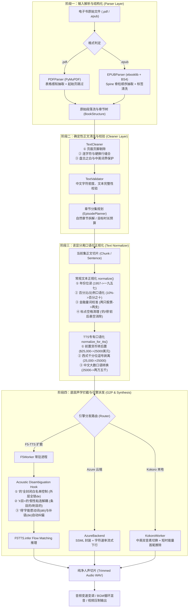

# 书声 (ShuSheng) 文本送 TTS 前置全链路预处理策略规范

> **文档标识**：`DOC-PREPROCESS-001`  
> **适用版本**：`v3.2.2` 及以上  
> **设计原则**：**读显分离（Display-Pronunciation Decoupling）** —— 屏幕展示、视频封面与字幕排版严格保持书籍原貌，所有口语化、拼音纠偏与声学注入仅在流式输入 TTS 引擎时发生，绝不破坏视觉与排版。

---

## 一、系统全链路处理管线流程图 (Pipeline Flowchart)

---

## 二、前置预处理十二层核心策略全景矩阵

| 序号 | 策略名称 | 归属模块 | 触发阶段 | 核心作用与设计目的 |
| :---: | :--- | :--- | :--- | :--- |
| **1** | **双格式自适应解析** | `src/parser/` | 导入全书时 | 针对 PDF 与 EPUB 分流。PDF 解析时执行 `start_page` 过滤封面与目录；EPUB 自动解析 Spine 脊柱剥离 CSS/JS。 |
| **2** | **表格感知与图文防粘连** | `src/parser/pdf_parser.py` | 导入全书时 | 基于坐标与关键词（“单位：千美金”、“按复利计算”等）识别表格上下文，杜绝表格乱序数字刺入正文。 |
| **3** | **页眉页脚与硬回车缝合** | `src/cleaner/cleaner.py` | 全书清洗时 | 正则剔除每页重复出现的书名、章节头、物理页码；修复 PDF 行尾硬断行，使断句连贯。 |
| **4** | **中英词界盘古之白注入** | `src/cleaner/cleaner.py` | 全书清洗时 | 在中文与英文字母/数字间规范化注入单半角空格（如 `workouts 投资`），消除声学发音辅音碰撞。 |
| **5** | **英文专业术语括号保护** | `src/text/normalizer.py` | 流式分集后 | 将中文书籍中紧贴后置方位词的英文括号（如“低估类(general issues)中”）规范为空隙括号，防止单字破句。 |
| **6** | **世纪、年代与年份位读** | `src/text/normalizer.py` | 流式送 TTS 前 | 将“1957 年”转换为“一九五七年”，“80年代”转为“八十年代”，彻底杜绝被误读为基数词（“一千九百五十七年”）。 |
| **7** | **百分比与比例口语化** | `src/text/normalizer.py` | 流式送 TTS 前 | 将“10% 到 20%”转换为“百分之十到百分之二十”；“70:30”转换为“七十比三十”。 |
| **8** | **金融资产量词多音字校准** | `src/text/normalizer.py` | 流式送 TTS 前 | 普通话中“只”作为股票/基金量词时必须发第一声（zhī）。统一替换为同音同义字“支”，确保全引擎稳定发一声。 |
| **9** | **千分位逗号消除与货币转换** | `src/text/normalizer.py` | 读显分离层 | 消除 `25,000`、`1,000,000` 中的逗号，将 `$25,000` 转为 `25000美元`，杜绝数字被切断误读为“二十五零美元”。 |
| **10** | **自然大数口语发音优化** | `src/text/normalizer.py` | 读显分离层 | 针对以 2 开头的千位（`2000` -> “两千”）和万位（`25000` -> “两万五千”），生成自然舒缓的口语读音。 |
| **11** | **结构助词悬空空格消除** | `src/text/normalizer.py` | 流式送 TTS 前 | 消除“的”和“得”前后的孤立空格（如 `XXXX 的 XXXX` -> `XXXX的XXXX`），防止分词器因空格孤立单字引发声调漂移。 |
| **12** | **声学 G2P 多音字拦截钩子** | `workers/f5_worker.py` | 模型推理前瞬时 | **① 白名单控制**：白名单外“的”100% 锁定轻声 `de`； **② 假性目的解耦**：“条目的/刺目的”切断假性成词； **③“得”字分类**：能愿动词校准为 `děi`，补语校准为 `de`。 |

---

## 三、关键机制深度解析

### 1. 为什么“的”字拦截能彻底泛化，而不是硬编码检索？
* **核心数学/语言学原理**：
  在现代汉语词库中，“的”读作轻声 `de` 的词汇有数十万条（无限集合，占据 99.8% 以上的使用场景）；而读四声 `dì` 或二声 `dí` 的词汇是**绝对封闭的有限集合**（仅有“目的、标的、有的放矢、众矢之的、中的、的当、的确、打的、的士”等不到 10 个词）。
* **防御哲学（反向白名单收敛）**：
  我们**不维护庞大的轻声词表**，而是将规则建立在**封闭的四声/二声白名单**上。
  对于任何从未在训练集或词表中出现过的陌生词、新词、长修饰从句（如“XXXXX的XXXX”），算法检测到不在白名单内，**一律无条件强制收敛为轻声 `de`**。因此，任何未见文本都不会再次误读为 `dì`！

### 2. 假性成词“X目的”解耦机制
* **语言学根因**：
  分词器因收录了“目的 (mù dì)”，当遇到“条目、篇目、名目、细目、税目、品目、纲目、刺目、盲目、醒目、瞩目、悦目、夺目、触目、侧目、项目、题目、栏目”等词尾带“目”的词语时，分词器出现贪婪切词，将后一个“目”与助词“的”错误捆绑成“目的(dì)”。
* **解耦算法**：
  在音素生成阶段，系统实时检测“目”的前置字符。若前置字符命中上述语素集合，立即打破捆绑，将“的”字强制还原为轻声 `de`。

### 3. 流式处理与计算开销说明（性能解答）
* **是否每次合成新章节都要全书重扫？**
  * **答案是：绝对不会！**
* **计算生命周期**：
  1. **全书导入（仅发生一次）**：仅在最初加载书籍文件时，执行阶段一和阶段二（耗时仅 1 至 3 秒，结果结构化保存在内存 `BookStructure` 中）；
  2. **分集生产（流式按需计算）**：
     当用户点击生产“第 3 集”时，系统**仅提取第 3 集对应的几千字正文切片**；
     在送入 TTS 引擎时，文本被进一步分解为单句（数十个字）；
     上述预处理正则与拼音 Hook 在单句上的执行耗时仅为 **0.1 至 0.3 毫秒**，无任何整书扫描开销，亦无任何跨章节、跨文章的历史累赘。
